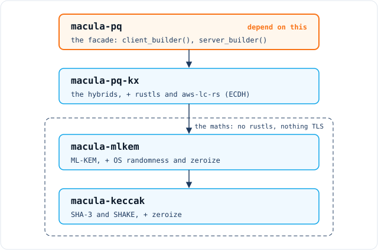
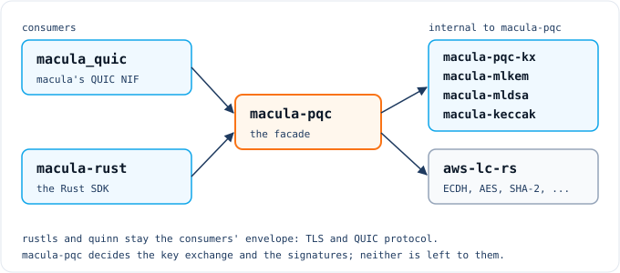

# macula-pqc

[](https://github.com/macula-io/macula-pqc/actions/workflows/ci.yml)
[](https://crates.io/crates/macula-pqc)
[](https://docs.rs/macula-pqc)
[](#license)
[](https://www.rust-lang.org)
[](https://github.com/rust-secure-code/safety-dance/)
[](https://github.com/sponsors/rgfaber)

<p align="center">
  <picture>
    <source media="(prefers-color-scheme: dark)" srcset="assets/macula-pqc-full-dark.svg">
    
  </picture>
</p>

<p align="center">
  <strong>Post-quantum cryptography library: hybrid TLS key exchange and ML-DSA signatures</strong>
</p>

---

> **Status, 2026-09-22:** early. 0.2.0 makes `macula-pqc`'s TLS
> signatures post-quantum. 0.1.2 added `macula-mldsa`, ML-DSA signatures.
> 0.1.1 was the first release under the name `macula-pqc`; 0.1.0 was
> released as `macula-pq`, since deleted from crates.io.
> **`macula-pqc` hands out rustls configuration builders locked to
> `SecP384r1MLKEM1024` then `SecP256r1MLKEM768`, both on this project's
> own ML-KEM, and to ML-DSA-87 signatures on this project's own ML-DSA,
> and nothing classical**, and makes the self-signed ML-DSA-87
> certificate a macula node presents. No rustls provider offers
> `SecP384r1MLKEM1024`: not `ring`, not `aws-lc-rs`, not rustls itself.
> **`macula-mlkem` passes every NIST ACVP vector for ML-KEM-512, -768 and
> -1024**, draws its seeds from the OS, wipes its secrets, and has been
> timed at ML-KEM-768 and -1024: no leak detected (see [What is not
> claimed](#what-is-not-claimed) for exactly what that means).
> `macula-keccak` passes NIST's ACVP vectors for SHA3-256/512 and
> SHAKE128/256, including the Monte Carlo chains. `macula_quic` and
> `macula-rust` key-exchange through `macula-pqc` 0.1 on their default
> branches, neither has released that yet, and neither is on 0.2 yet.
> **`macula-mldsa` passes every pure NIST ACVP vector for ML-DSA-44, -65
> and -87**, signs hedged from the OS with keys expanded or as seeds, and
> agrees with OTP's `crypto`. See [Status](#status).

## What is this?

**Post-quantum cryptography library: hybrid TLS key exchange and ML-DSA
signatures.** ML-KEM (FIPS 203), ML-DSA (FIPS 204), the Keccak primitives
both are built on, the hybrid key exchange groups that combine ML-KEM with
elliptic-curve Diffie-Hellman for rustls, and ML-DSA-87 as rustls's
signature scheme.

The genuinely distinctive part is **`SecP384r1MLKEM1024`**, which **no
rustls provider ships**: not `ring`, not `aws-lc-rs`, not rustls itself.

⚠ **The ML-KEM here is not special and this README will not pretend it
is.** FIPS 203 is a NIST standard with several good implementations,
`aws-lc-rs` and RustCrypto's `ml-kem` among them. Ours is written from
scratch and verified byte-exact against NIST's own ACVP vectors, which is
a claim about **independence and assurance**, not about being first or
better.

**Why it exists.** Macula's `pq_hybrid` profile declares
`SecP384r1MLKEM1024`, and no rustls provider implements it. OTP's own
`ssl` does, from OTP 28.4, but **macula's transport is QUIC through a
Rust NIF, and OTP's `ssl` does not do QUIC**: the TLS inside it is
rustls, so the group has to exist as a rustls provider. Building the
primitives here rather than depending on them also means the
post-quantum parts of
[Macula](https://github.com/macula-io/macula) are not supplied by an
external library, which is the reason for the boundary described below.

## Getting started

```toml
[dependencies]
macula-pqc = "0.2"
rustls = { version = "0.23", default-features = false, features = ["std"] }
```

```rust
use rustls::pki_types::{CertificateDer, PrivateKeyDer};
use rustls::{ClientConfig, RootCertStore, ServerConfig};

/// A certificate and key: ML-DSA-87, self-signed, from a 32-byte seed.
fn identity(
    seed: &[u8; 32],
) -> Result<(CertificateDer<'static>, PrivateKeyDer<'static>), rustls::Error> {
    macula_pqc::self_signed_certificate(seed, vec!["localhost".to_string()])
}

/// A client: you choose how the server is verified.
fn client(roots: RootCertStore) -> ClientConfig {
    let mut config = macula_pqc::client_builder()
        .with_root_certificates(roots)
        .with_no_client_auth();
    config.alpn_protocols = vec![b"macula".to_vec()];
    config
}

/// A server: you choose client authentication and the certificate.
fn server(
    chain: Vec<CertificateDer<'static>>,
    key: PrivateKeyDer<'static>,
) -> Result<ServerConfig, rustls::Error> {
    macula_pqc::server_builder()
        .with_no_client_auth()
        .with_single_cert(chain, key)
}
```

Both offer `SecP384r1MLKEM1024`, then `SecP256r1MLKEM768`, and nothing
else, and both sign and verify ML-DSA-87 and nothing else: the
certificate and its key must be ML-DSA-87, which
`macula_pqc::self_signed_certificate` makes from a 32-byte seed.
Everything else about the configuration is yours. For QUIC, hand
the result to quinn as usual. This code is compiled by `macula-pqc`'s tests,
and [the crate documentation](https://docs.rs/macula-pqc) runs a fuller
example.

## The crates

**Depend on `macula-pqc` for TLS, and on `macula-mldsa` for ML-DSA
signatures outside TLS.** `macula-mldsa` is its own entry point on purpose: it
brings no TLS, so a signer does not take rustls and `aws-lc-rs` with it.
The others are implementation crates, published only because cargo
refuses to publish a crate whose path dependencies are not themselves on
the registry, and not advertised as entry points: nothing in this stack
needs SHA-3 outside ML-KEM and ML-DSA, since TLS uses SHA-2.

| Crate | What it is | State |
|---|---|---|
| **`macula-pqc`** | **The facade. This is what you depend on.** | `client_builder()` / `server_builder()`: locked to our two hybrids and ML-DSA-87, nothing classical; `self_signed_certificate()`. 0.1, key exchange only, is used by `macula_quic` and `macula-rust` on their default branches, in neither's release yet |
| `macula-keccak` | Keccak-f[1600], SHA3-256/512, SHAKE128/256 | complete, NIST ACVP vectors passing |
| `macula-mlkem` | ML-KEM (FIPS 203) | complete: NIST ACVP vectors passing, seeds from the OS, secrets wiped, timed |
| **`macula-mldsa`** | **ML-DSA (FIPS 204) signatures: depend on this to sign or verify.** | complete: key generation, signing (both key formats) and verification pass NIST's vectors at all three parameter sets; signing timed, secrets wiped, seeds from the OS, agrees with OTP; `macula-pqc`'s TLS signatures and macula's node keys use it |
| `macula-pqc-kx` | Hybrid TLS key exchange groups, including `SecP384r1MLKEM1024` | complete |

⛔ **These are separate crates rather than one with modules because the
layering is load-bearing:**

<p align="center">
  
</p>

Collapse that and anyone wanting ML-KEM or ML-DSA is forced to take
rustls and `aws-lc-rs` with it. **If `macula-mlkem` or `macula-mldsa` ever
gains a rustls dependency that separation is gone**, and it will not be
visible from inside the crate.

### `SecP384r1MLKEM1024`, and why it had to be written

It is the key exchange group macula's `pq_hybrid` profile declares, and
**no rustls provider supplies it**. BSI TR-02102-2 states it *intends to
recommend* the group once the corresponding RFC is adopted. OTP's `ssl`
implements it, but macula's QUIC runs on rustls, so until this workspace
the profile's declaration could not be true on macula's transport.

## Features

- **rustls configuration builders locked to post-quantum key exchange
  and signatures.** `client_builder()` and `server_builder()` fix the
  groups, ML-DSA-87 and TLS 1.3; a classical-only peer cannot connect,
  and a classical certificate or signature is refused.
- **ML-DSA-87 in TLS 1.3** (code point `0x0906`), for certificates and
  CertificateVerify, on `macula-mldsa`; keys in RFC 9881's PKCS#8 forms,
  seed, expanded or both. `self_signed_certificate()` makes a node's
  certificate from a 32-byte seed.
- **`SecP384r1MLKEM1024` and `SecP256r1MLKEM768` as rustls key exchange
  groups**, composed per
  [draft-ietf-tls-ecdhe-mlkem](https://datatracker.ietf.org/doc/html/draft-ietf-tls-ecdhe-mlkem-05);
  `SecP384r1MLKEM1024` is code point `0x11ED`.
- **ML-KEM-512, -768 and -1024 (FIPS 203)**, seeds from the OS, secrets
  wiped when dropped, timing measured with a calibrated harness.
- **ML-DSA-44, -65 and -87 (FIPS 204)**, keys expanded or as 32-byte
  seeds, signing hedged from the OS, secrets wiped when dropped, signing
  timed.
- **SHA3-256, SHA3-512, SHAKE128 and SHAKE256**, with an incremental
  SHAKE128 reader for multi-block squeezing.
- **Byte-exact verification against the standards bodies' own test
  vectors**, vendored with provenance and per-file checksums.
- **No `unsafe` in any crate**: every crate carries `#![forbid(unsafe_code)]`.
  The two files with `unsafe` in them are tests, `heap_residue.rs` in
  `macula-mlkem` and `macula-mldsa`, because the allocator they need cannot
  be written without it.
- **No copied constants.** Lengths are measured from live components and
  the NTT's zeta table is computed at compile time from its definition,
  because one mistyped digit in a transcribed table gives a coherent
  implementation that fails everything with no hint where.

## The boundary, precisely

| | |
|---|---|
| **Ours** | Keccak (**inside ML-KEM and ML-DSA only**), ML-KEM, ML-DSA, the hybrid composition, ML-DSA-87 in rustls: its signing, its verification and its PKCS#8 and public key encodings |
| **The platform** | The OS CSPRNG |
| **`aws-lc-rs`** | AES-GCM, ChaCha20-Poly1305, SHA-2, HKDF, P-256 and P-384 ECDH, the TLS layer's own randomness |
| **`rcgen`** | The X.509 structure of the self-signed certificate; the signature on it is `macula-mldsa`'s |

**The rule is that `aws-lc-rs` supplies no post-quantum primitive.**
Everything left to it is either quantum-safe already or paired with ML-KEM
in a hybrid, so none of it is ours to write. **It verifies no signature**:
the provider's verification algorithms are ML-DSA-87 alone, so a
classical certificate or CertificateVerify is refused rather than handed
to `aws-lc-rs`. Writing our own AES-GCM would
buy nothing and cost real safety.

⚠ **Keccak appears in the `CryptoProvider` only inside ML-KEM and
ML-DSA.** TLS 1.3's key schedule and transcript hash use SHA-256 and
SHA-384, not SHA-3, so `macula-keccak` is used **only inside the two
post-quantum primitives**. "We own the hashing" is false at the TLS layer
and true inside the post-quantum primitives.

**rustls and quinn are the envelope**: TLS and QUIC protocol engineering.
There is no reason to own that.

### Randomness comes from the operating system, deliberately

ML-KEM key generation and encapsulation, and ML-DSA key generation and
signing, take randomness from the **OS CSPRNG**, trusted as part of the
platform. Not `aws-lc-rs`, and
**emphatically not ours**.

**A hand-written CSPRNG is the one piece of this where rolling your own
would be unambiguously wrong.** Every other crate here is verifiable
against published vectors; randomness has none, because you cannot test
that output is unpredictable. It is the one place a bug would be invisible
to the method everything else depends on.

## How this is consumed

<p align="center">
  
</p>

**`aws-lc-rs` sits behind the facade, not beside it.** A consumer depends
on `macula-pqc` and nothing else for crypto: no provider selection, no
`ring` or `aws-lc-rs` feature flags in its manifest.

1. **The `kx_groups` list and the signature algorithms exist in exactly
   one place, each with its negative control beside it.** A second copy
   could regain a classical group or signature while the control guarding
   the first one kept passing.
2. **Replacing `aws-lc-rs` changes this workspace and no consumer**: the
   facade's default-provider line and the two ECDH halves in
   `macula-pqc-kx`.

⚠ **THIS IS THE SHAPE ON BOTH CONSUMERS' DEFAULT BRANCHES, NOT YET IN
A RELEASE OF EITHER.** `macula_quic` and `macula-rust` depend on
`macula-pqc` 0.1, take their key exchange from its builders, and select
no rustls provider of their own. **Neither is on 0.2 yet**, so both still
present and accept classical certificates.

## Testing

```sh
./scripts/test.sh
```

Nine gates: `cargo test`, `cargo test --release`, `cargo clippy -D
warnings` twice, `cargo doc` with warnings denied,
`scripts/check-packaging.sh`, `scripts/check-readme.sh`,
`scripts/test-check-release.sh`, `cargo fmt --check`. CI runs this same script rather than restating the gates, so
the two cannot drift. Every public item must be documented: each crate
carries `#![warn(missing_docs)]`, which clippy's `-D warnings` makes an
error.

**Packaging is checked on every commit, not at release time.**
[`check-packaging.sh`](scripts/check-packaging.sh) packages every
crate for crates.io, offline, and builds each one from its package: a
package is not the tree, since `macula-mldsa` leaves NIST's vectors out,
and source reading an excluded file would build here and fail for every
consumer. It works on a copy with any `publish = false` removed, because
cargo will not package a crate against a dependency marked
unpublishable, as a new crate is until its first release.

**Clippy runs twice because tests and consumers build different
libraries.** `macula-mlkem`'s own tests switch on its `internal` feature,
and a build that includes them compiles the library with it. The second
run builds the libraries alone, which is what a consumer gets.

**Both build profiles are required and neither is redundant.** Debug panics
on arithmetic overflow, which is how a real i32 overflow in this
workspace's Barrett reduction was caught; in release it would have wrapped
silently. Release is the binary that ships and the only place the
optimiser's output exists, so **a constant-time claim tested only in debug
is untested**.

### The pre-commit gate

`.githooks/pre-commit` runs the same script and **refuses any commit that
fails**. Enable it after cloning:

```sh
git config core.hooksPath .githooks
```

⚠ If a commit genuinely must bypass it, use `--no-verify` **and say so in
the commit message with the reason**. An undocumented bypass that everyone
uses silently is worse than a documented one used twice.

### Timing

```sh
./scripts/timing.sh
```

**Not part of the gate**: it takes minutes, and a shared CI runner is too
noisy to time on. It times decapsulation and encapsulation at ML-KEM-768
and ML-KEM-1024, and signing at ML-DSA-87 and ML-DSA-65, in a release
build, dudect-style, and each run checks itself before its results mean
anything:

- **Positive control**: a real decapsulation with an early-exit `==`
  planted after it. Not flagged, and the run exits 2.
- **Negative control**: byte-identical ciphertexts reached by two
  different preparation paths. Flagged, and the run exits 3.

The positive control is sized to the leak it stands for. With `decaps`'s
constant-time compare replaced by `==` and a branch, the valid-against-
invalid test flags it; with the real code it does not.
[`examples/timing.rs`](macula-mlkem/examples/timing.rs) documents the
method and the confounds the negative control exposed.

**Signing is timed against what FIPS 204 lets it vary with.** Signing
loops until an attempt passes, and may take as long as its attempts take;
within one, the public `rho` and the published commitment hash drive
their own sampling. So both classes share all of those, and every input
signs in exactly one attempt: the classes differ only in the secret
polynomials. Its positive control is a branch on the secret key's bytes,
taken as often as a hint bit is set, because that is the shape of the one
difference the harness found: `HintBitPack` branched on each hint bit,
and was flagged until it was made branch-free (|t| 9.73 and 15.15 before,
1.48 and 0.90 after, at 40,000 measurements).
[`examples/signing_timing.rs`](macula-mldsa/examples/signing_timing.rs) documents both.

### Interop with OTP

```sh
OTP_BIN=/path/to/otp/bin ./scripts/otp-interop.sh
```

OTP's own `ssl` implements `SecP384r1MLKEM1024` and `SecP256r1MLKEM768`
independently: its hybrid composition is Erlang, its ML-KEM and ECDH come
from its `crypto` library. No Rust implementation of `SecP384r1MLKEM1024`
exists to exchange with, so **this is the only independent check of that
composition**. It also signs and verifies ML-DSA-87 in TLS 1.3 with its
`crypto`, independently of `macula-mldsa`.

It runs real TLS 1.3 handshakes over TCP between `macula-pqc` and OTP, in
both roles, with OTP offering one group at a time and only ML-DSA-87, and
a `ping`/`pong` crossing each connection. Every certificate on our side is
ML-DSA-87, from `self_signed_certificate`; when OTP serves, it presents
the same certificate with the key loaded from our PKCS#8 encoding. OTP
also checks the certificate's own signature, separately, since a
handshake never checks a trusted certificate's. The negative controls: a
classical-only OTP peer must be refused in both roles, an OTP client
offering only classical signatures must be refused by our server, and an
OTP server with an Ed25519 certificate by our client. **Not part of the
gate**, because it needs OTP 28.4 or later and CI has none.
[`examples/otp_interop.rs`](macula-pqc/examples/otp_interop.rs) documents
it; exit codes are in [`scripts/otp-interop.sh`](scripts/otp-interop.sh).

Result on OTP 28.4.2, whose `crypto` is OpenSSL 3.6.4: both hybrids agree
in both roles, with ML-DSA-87 signing and verifying on each side, OTP
verifies our certificate, and all four negative controls are refused.
With `SecP384r1MLKEM1024`'s share order reversed in `macula-pqc-kx`, both
of its cases fail and the 768 cases still pass. With a context byte
planted in our handshake signer, the two cases where we serve fail; in our
verifier, the two where we dial; in our certificate signer, OTP's
certificate check and the two cases where our client meets that
certificate.

**`macula-mldsa` is checked against OTP's `crypto` in the same run**, the
ML-DSA the fleet's existing node keys were made with. Signing is hedged on
both sides, so no signatures are compared. What must agree: the public key
each side derives from the other's private key, byte for byte, and each
side's signatures verifying on the other, with the key expanded and as its
seed. A signature on another message, and one made under a context OTP
cannot see, must be refused. On OTP 28.4.2 all 30 cases pass at ML-DSA-44,
-65 and -87; with the public signing path's domain byte planted as 1, every
case where OTP verifies ours fails.
[`examples/otp_signature_interop.rs`](macula-mldsa/examples/otp_signature_interop.rs)
documents it.

### How these crates are verified

**Against the standards bodies' own vectors, byte-exact, vendored with
provenance and checksums**: not against each other, and not by round
trip, because two matching wrong implementations agree perfectly.

`macula-keccak` runs NIST's ACVP vectors for SHA3-256, SHA3-512, SHAKE128
and SHAKE256, including the Monte Carlo chains, plus FIPS 202 known
answers. See [`macula-keccak/vectors/README.md`](macula-keccak/vectors/README.md)
for provenance, checksums, and why two vector revisions are used rather
than the one named after the standard.

`macula-mlkem` runs NIST's ACVP vectors for key generation,
encapsulation, decapsulation and both key checks, at all three parameter
sets. The fifteen implicit-rejection cases are each identified by NIST's
own label, so none can pass for the wrong reason unnoticed. See
[`macula-mlkem/vectors/README.md`](macula-mlkem/vectors/README.md) for
provenance and checksums.

**Wiping is measured on the heap.**
[`heap_residue.rs`](macula-mlkem/tests/heap_residue.rs) replaces the
global allocator and scans every block freed during key generation,
encapsulation and both kinds of decapsulation, at all three parameter
sets, for that run's secrets: seeds, PRF outputs, noise polynomials, the
secret key, shared secrets. It finds none, and it does catch the two
mistakes most likely to creep back: a key grown into its buffer instead
of allocated at its final size, and a secret temporary left unwrapped.
[`macula-mldsa`'s](macula-mldsa/tests/heap_residue.rs) does the same
through key generation and signing with both key formats, for the seed,
`rho'`, `K`, the private key's secret bytes, `rnd` and `rho''`. There the
heap holds only the private key and a seed's per-signature expansion:
the working secrets live in wiped stack arrays, which this cannot see.

Where no vectors exist, the claim is stated as what it is.
`macula-pqc-kx`'s hybrid composition has none published, so it is verified
**differentially** against rustls's independently written implementation of
the same draft, and its documentation says so rather than implying more.
That exchange runs `SecP256r1MLKEM768` on our ML-KEM against rustls's on
`aws-lc-rs`'s, so it checks our ML-KEM-768 on the wire as well as the
composition. It passed before the ML-KEM half was moved onto
`macula-mlkem` and after. `SecP384r1MLKEM1024`'s composition has no Rust
counterpart; it is checked against OTP's `ssl`, outside the gate (see
[Interop with OTP](#interop-with-otp)).

## Status

**Done**

- `macula-keccak`: SHA3-256/512, SHAKE128/256, incremental SHAKE128
  squeezing and SHAKE256 absorbing and squeezing; ACVP AFT, VOT and MCT
  vectors, plus FIPS 202 known answers, and every SHAKE256 vector again
  in pieces.
- `macula-pqc-kx`: `SecP384r1MLKEM1024` and `SecP256r1MLKEM768`, both on
  `macula-mlkem`, verified differentially against rustls's
  `SECP256R1MLKEM768` and against `aws-lc-rs`'s ML-KEM-768 and -1024.
- `macula-mlkem`: key generation, encapsulation, decapsulation with
  implicit rejection, and both key checks, at ML-KEM-512, -768 and -1024.
  Every ACVP vector passes byte-exact. Key generation and encapsulation
  draw their seeds from the OS and return an error if it cannot supply
  them; the seeded forms are behind the testing-only `internal` feature,
  as FIPS 203 sections 3.3 and 6 require. Secrets are wiped when dropped,
  and none survives on the heap.
- `macula-mldsa`: key generation, signing and verification at ML-DSA-44,
  -65 and -87, every pure ACVP vector passing byte-exact; keys expanded or
  as 32-byte seeds, signing hedged from the OS, secrets wiped when
  dropped, and agreement with OTP's `crypto` in both directions.
- The timing harness, with a positive and a negative control.
  ML-KEM-768 and -1024 measured: no leak detected. ML-DSA-87 and -65
  signing measured against what FIPS 204 lets it vary with: no leak
  detected, after `HintBitPack` was made branch-free.
- `macula-pqc`: `client_builder()` and `server_builder()`, rustls builders
  with the provider and TLS 1.3 already fixed, so no caller can change the
  groups: `SecP384r1MLKEM1024` then `SecP256r1MLKEM768`, from
  `macula-pqc-kx`, and nothing classical; signatures ML-DSA-87 alone, from
  `macula-mldsa`, for certificates and CertificateVerify, with PKCS#8 keys
  as a seed, expanded, or both. `self_signed_certificate()` makes a node's
  certificate from a 32-byte seed. No function returns the provider
  itself. Tested with real TLS 1.3 handshakes: two peers on it agree on
  `SecP384r1MLKEM1024`; a peer on `macula_quic`'s current list agrees on
  `SecP256r1MLKEM768`, our ML-KEM against `aws-lc-rs`'s, in both roles;
  and a classical-only peer, or one with classical signatures, cannot
  agree with it in either role.
- Interop with OTP 28.4.2's `ssl`, outside the gate: both hybrids agree in
  both roles with ML-DSA-87 on both sides, OTP verifies our certificate,
  and classical key exchange, classical signatures and a classical
  certificate are refused.
- The gate: nine checks, two build profiles, one script, run by the
  pre-commit hook and by CI.

- Released to crates.io as 0.1.0, under the names of the time:
  `macula-pq`, `macula-pq-kx`, `macula-mlkem` and `macula-keccak`, from
  one tag; and as 0.1.1 under the new names, `macula-pqc` and
  `macula-pqc-kx`, with `macula-mldsa` withheld; 0.1.2 releases
  `macula-mldsa`. `macula-pq` and `macula-pq-kx` have since been deleted
  from crates.io. See [CHANGELOG.md](CHANGELOG.md).

- `macula_quic` (in `macula`) and `macula-rust` key-exchange through
  `macula-pqc` 0.1 on their default branches; neither has released it.
- macula's node keys and UCAN tokens sign through `macula-mldsa`, and its
  EU hybrid is the LAMPS composite, on macula's default branch; not
  released.

**Not done**

- `macula_quic` and `macula-rust` on `macula-pqc` 0.2, so that their TLS
  certificates and handshake signatures are ML-DSA-87.

## Releasing

A `vX.Y.Z` tag is the release.
[`release-core.yml`](.github/workflows/release-core.yml)'s `verify` job
runs [`check-release.sh`](scripts/check-release.sh), the gate and a
dry-run publish, then `publish` runs in the `crates-io` environment with
no approval step. That environment admits only `v*.*.*` tags and holds
the crates.io API token, so nothing else can read it. A crate already on
crates.io publishes by Trusted Publishing instead, with a short-lived
token for the job's OIDC identity: every such crate accepts nothing else.
The API token is used only for a crate crates.io has never seen, which
Trusted Publishing cannot create
([`publish-crates.sh`](scripts/publish-crates.sh)).

**A crate still being built is withheld, and said to be.** It carries
`publish = false` and a reason in `[package.metadata.withheld]`; the tag
releases the others. `check-release.sh` refuses a tag when nothing is
publishable (cargo would report success and release nothing), when a
version differs from the tag's, or when a crate carries the flag without
a reason or a reason without the flag, and both jobs write a table of what was published and what was
withheld, and why, to the run summary. cargo refuses to publish a crate
that depends on a withheld one, which the dry run exercises first.

## What is not claimed

**Nothing here is claimed to be constant-time.**

`macula-mlkem` has been **measured**, which is a different thing. On one
AMD Ryzen 9 5950X, rustc 1.98.1, release build, 200,000 measurements per
test, the harness detected no timing difference at ML-KEM-768 or
ML-KEM-1024 in decapsulation (valid against invalid ciphertexts; one fixed
ciphertext against random valid ones) or encapsulation (fixed against
random messages), with both controls behaving at both. **That is "no leak
detected at that n, on that machine, with that compiler"**, not a proof.
ML-KEM-512 has not been timed: nothing negotiates it.

`macula-mldsa`'s signing has been **measured** the same way, on the same
machine and compiler, 40,000 measurements per test: no timing difference
detected between fixed and random secret polynomials at ML-DSA-87 or
ML-DSA-65, among inputs signing in one attempt, with both controls
behaving at both. The number of attempts, and the sampling driven by
public data, vary by design and were held fixed rather than measured.
ML-DSA-44 shares ML-DSA-87's code paths and has not been timed. Key
generation and verification have not been timed: verification handles
only public data, and key generation's secret seed also sets the public
`rho`.

`macula-keccak` is measured only inside ML-KEM and ML-DSA, where it hashes
secret data. On its own it rests on an argument from the algorithm's shape: there
is no secret-dependent branch or table index to write, since the round
count is fixed, the rotation offsets are compile-time constants and the
round constants are indexed by round number. **That is an argument, not a
measurement.**

`macula-pqc-kx`'s composition has not been timed. Its ML-KEM half is
`macula-mlkem`, timed as above; its ECDH half is `aws-lc-rs`'s.

**Wiping is measured on the heap only.** Values on the stack are wiped by
construction, which safe code cannot observe, and copies the compiler
makes when it moves or spills a value, or leaves in registers, are beyond
any of it, as `zeroize` itself states.

**MSRV is not established.** The gate runs on stable; no minimum has been
determined or tested.

## Related projects

| Project | Description |
|---|---|
| [macula](https://github.com/macula-io/macula) | The reference SDK (Erlang/OTP) whose `pq_hybrid` profile declares `SecP384r1MLKEM1024`; its QUIC NIF, `macula_quic`, consumes this facade |
| [macula-rust](https://github.com/macula-io/macula-rust) | Rust SDK, which consumes this facade |
| [macula-station](https://github.com/macula-io/macula-station) | The station: DHT, SWIM, routing, peering |
| [macula-realm](https://github.com/macula-io/macula-realm) | Managed-realm identity + certificate authority |

## Contributing

See [CONTRIBUTING.md](CONTRIBUTING.md) and the
[Code of Conduct](CODE_OF_CONDUCT.md). **Report a vulnerability
privately**, through GitHub's
[private vulnerability reporting](https://github.com/macula-io/macula-pqc/security/advisories/new),
never in a public issue.

## License

Licensed under the Apache License, Version 2.0 ([LICENSE](LICENSE) or
<http://www.apache.org/licenses/LICENSE-2.0>).

Unless you explicitly state otherwise, any contribution intentionally
submitted for inclusion in this workspace by you shall be licensed as
above, without any additional terms or conditions.
